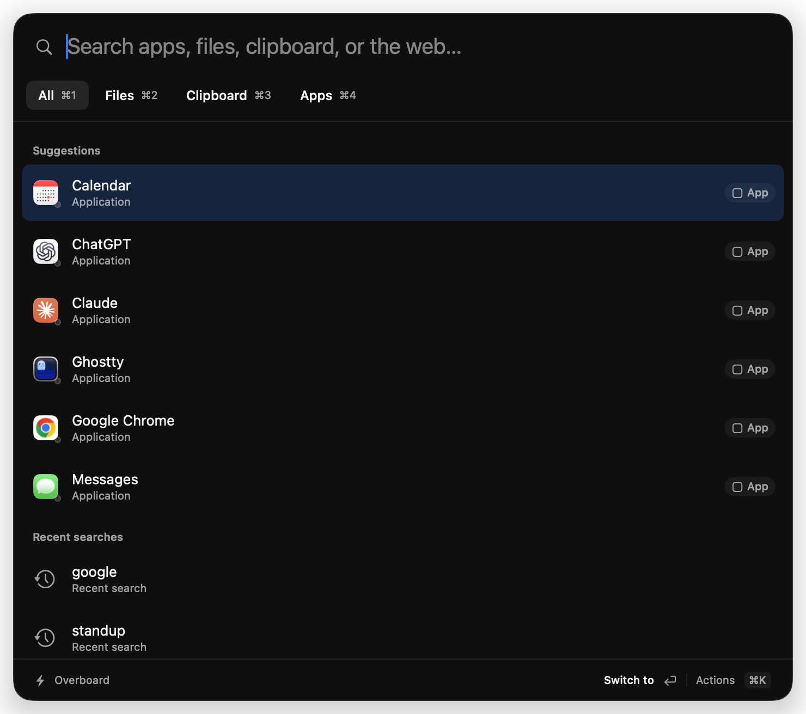
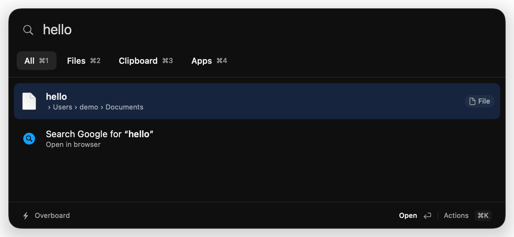
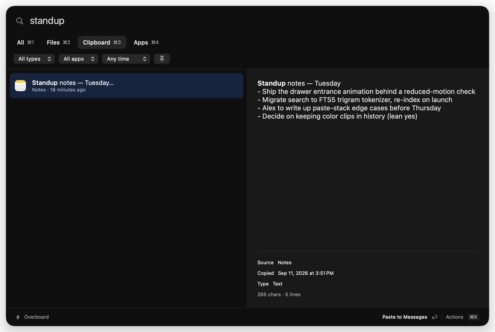

# Overboard ⛵️

[](https://github.com/nickysemenza/overboard/actions/workflows/ci.yml)

A native macOS launcher and clipboard manager. Find files across your Mac and
iCloud Drive, open apps, search Google, or retrieve something you copied. A fast
bottom drawer handles recent pastes; the launcher adds a full clipboard browser.

<p align="center">
  
</p>

## Status

Feature-complete against the original roadmap and daily-driven by its author.
It's a personal tool first — issues and PRs are welcome, but it tracks one
person's workflow and taste.

## Install

**Homebrew:**

```sh
brew install --cask nickysemenza/tap/overboard
```

The cask lives in [nickysemenza/homebrew-tap](https://github.com/nickysemenza/homebrew-tap)
and downloads the same signed and notarized zip as the Releases page;
`brew upgrade` picks up new releases because the release workflow bumps the
cask there. If you installed back when this repo was its own tap, switch
once with `brew untap nickysemenza/overboard` before installing from the
new one, or `brew upgrade` will complain about the cask existing in two taps.

Or grab the zip from
[Releases](https://github.com/nickysemenza/overboard/releases) — releases are
signed with a Developer ID certificate and notarized by Apple, so a plain
double-click works, no right-click → Open dance needed. Or build from source
(macOS 26+, Xcode 26+):

```sh
git clone https://github.com/nickysemenza/overboard && cd overboard
xcodebuild -project Overboard.xcodeproj -scheme Overboard \
  -configuration Release -derivedDataPath build build
open build/Build/Products/Release   # drag Overboard.app to /Applications
```

Building from source signs with *your* Apple Development identity — set your
team in Xcode's Signing settings, or pass `CODE_SIGNING_ALLOWED=NO` (see the
signing note below for the TCC consequences).

Overboard lives in the menu bar (no Dock icon). First launch opens a Welcome
window with the three shortcuts and an Accessibility button; grant
**Accessibility** there or when prompted (System Settings → Privacy & Security)
— paste-back synthesizes ⌘V into the target app and falls back to copy-only
without it. The first time you copy from a browser, macOS also prompts for
**Automation** permission for that browser — this powers Back-to-source
(capturing the page URL/title); declining just skips provenance for that
browser. Settings → Permissions shows every one of these, plus any folders the
file index couldn't read, and can ask for them again. No analytics, no
account. Network is used only for one opt-outable feature: fetching
link-preview metadata (page title, favicon, description, og:image — toggle in
Settings → General). All clipboard data stays on your machine.

### Network activity

Overboard makes exactly one kind of outbound request, on by default but
toggleable, and it never sends any of your clipboard content:

- **Link-preview metadata** — fetches a copied page's title, favicon,
  description, and og:image. Toggle: Settings → General → "Fetch link titles
  and icons".

It uses an ephemeral `URLSession` with cookie storage and the URL cache
disabled, so the request can't read or leave behind cookies, and nothing is
cached to disk. The app does not check for updates itself — `brew upgrade`
is the update path.

## Features

- **Capture**: clipboard history for text, rich text, links, images, files,
  and colors, with content-hash dedupe and source-app attribution.
- **Card metadata**: text cards display character and line counts; images show
  pixel dimensions; file cards display item counts. Rich link cards fetch page
  title, favicon, description, and og:image preview (toggle in Settings).
- **Back-to-source**: clips copied from Safari/Chrome/Arc/Brave/Edge/Vivaldi
  remember the page URL and title; "Open Source Page" action in Quick Look
  and context menu. First copy per browser triggers a macOS Automation prompt.
- **Drawer** (⌘⇧V): bottom overlay over any app that never steals focus.
  Type to search, ←/→ or ⌘1–9 to select, ↩ to paste, ⇧↩ plain text,
  ⌘P pin, ⌘⌫ delete, esc to dismiss. Drag cards out to other apps.
- **Launcher** (⌥Space): **All · Files · Clipboard · Apps**, with ⌘1–4 to
  switch scopes. Exact names and aliases rank above path/word matches and fuzzy
  matches; successful selections improve ordering within a match tier. The empty
  launcher suggests apps using successful-launch frequency and recency, with
  running apps as an initial fallback and recent searches beneath. Enter
  always activates the selected row, even when results arrive in the background.
  The explicit Google row handles punctuation such as `c++` correctly.
- **Files**: a background SQLite filename/path index covers accessible home
  folders, iCloud Drive (including its Desktop/Documents), and Finder-visible
  cloud-storage folders. `wedding budget` matches a budget file inside a Wedding
  folder. Accent-insensitive matching, typo tolerance, readable breadcrumbs,
  and cloud status; Open, Reveal in Finder, Copy Path, and ⌘Y preview actions.
  Settings → Files controls roots, exclusions, rebuilding, and indexing status.
  Indexing reads metadata only. Cloud files download only when **Download & Open**
  is chosen; selecting or highlighting a result does not read its contents.
- **Clipboard browser**: choose Clipboard scope or **Browse History** in the
  existing bottom drawer for a large adjacent content preview. Filter by type,
  source app, date, or pins; OCR is searchable. Browsing groups by time, search
  ranks by relevance, and both views use the same history and paste-back service.
- **Launcher extras**: inline calculator (`15% of 80` → ↩ copies, ⌘↩ pastes),
  app initials and custom aliases (`sm` matches Sublime Merge), snippets, system
  settings, now playing, and Ask AI stay available in All. **⌘K** opens per-row
  actions. Running apps have indicator dots and Switch to / Quit App actions.
- **Emoji picker** (⌃⌘Space): a Raycast-style searchable emoji grid with
  category sections and a Recently Used row. Type to filter by name or keyword
  ("fire", "shrug"), arrows to move, ↩ pastes into the app you were in, ⌘↩
  copies. The default shortcut takes over the system emoji viewer's binding
  while Overboard runs — re-record it in Settings to get the system one back.
- **Launcher commands**: `:stats` (word/char/line stats), `:pause` / `:resume`
  (toggles clipboard capture; menu-bar indicator), `:clear` (clears history,
  keeps pins), `:settings`, `:version`. Plus `:` to open the commands palette.
- **System actions**: `lock` / `sleep` / `restart` rows run Lock Screen, Sleep,
  and Restart without leaving the launcher.
- **Audio output**: switch the system's default output device from a launcher
  row, current device marked.
- **Quicklinks**: user-defined keywords (Settings → General) open or search a
  URL template, same alias syntax as app aliases.
- **Shell commands**: `> <command>` runs a command line in a new Ghostty window.
- **Scope cycling**: Tab / ⇧Tab cycle All → Files → Clipboard → Apps without
  leaving the search field.
- **Unit conversion**: `5 mi in km` and friends convert length, mass,
  temperature, and more inline, alongside the calculator.
- **Calendar**: an up-next row above Now Playing, plus `cal` / `today` /
  `tomorrow` listings, with one-key join and Open in Calendar actions.
- **Backup**: Settings → History exports the library to a folder of NDJSON plus
  the large payloads it references, and imports one back (skipping clips you
  already have, by content hash). Detected secrets are left out unless asked
  for — they're TTL-limited on purpose. `overboard export <dir>` writes the same
  archive from the shell; restoring is app-only, since it writes to the store.
- **Shortcuts, Siri & Spotlight**: App Intents for Copy Latest Clip, Search
  Clipboard History, Copy Snippet (with a snippet picker), Set Clipboard
  Capture, Show Drawer, and Show Launcher. Clips themselves are never exposed
  as entities or indexed, so secrets stay out of Spotlight.
- **Search**: FTS5 full-text with prefix matching, blended with on-device
  semantic search (NLEmbedding) so "money projection" finds "quarterly
  revenue forecast". Filter operators: `kind:image`, `app:claude`,
  `category:code`. Searchable by link page title when preview fetch is enabled.
  All search happens on-device.
- **Quick Look & edit**: space (or ⌘Y) expands the drawer into a full-content
  preview — scroll long text, see images large, browse with ←/→, view source-page
  URL and title. ⌘E edits the text inline before pasting (⌘↩ pastes the edited
  version).
- **Code previews**: Finder, Spotlight Quick Look, and the launcher share an
  on-demand syntax preview for source, configuration, markup, plain-text, log,
  CSV, and TSV files, plus other extensions macOS explicitly identifies as
  `public.plain-text`. Previews read at most 256 KiB only after selection;
  their bounded sample is signature-checked before decoding and never feeds the
  file index. Rich `public.text` formats such as RTF, PDFs, images, Office/iWork
  documents, archives, media, databases, and app bundles keep their system or
  vendor preview.
- **OCR**: copied images and screenshots are text-recognized (Vision) and
  fully searchable by their contents — find that wifi-password screenshot
  by typing the network name.
- **Apple Intelligence** (macOS 26, on-device, optional): clips get short
  auto-generated titles and category badges (code, error, address, …), and
  the card menu gains AI transforms — summarize, fix grammar, make
  formal/casual, extract action items.
- **Paste-back**: synthesized ⌘V into the app you were in, then your previous
  clipboard is restored. Falls back to copy + HUD without Accessibility.
- **Paste stack**: ⌘↩ queues items in the drawer; ⌥⌘V pastes them one by one.
- **Snippets** (⌘/ in drawer): saved templates with `{date}` `{time}`
  `{datetime}` `{uuid}` `{clipboard}` placeholders, managed from the menu bar.
- **Transforms**: right-click → Paste Transformed (strip tracking params,
  trim, change case).
- **Privacy**: password managers and concealed/transient pasteboards are
  never captured; detected secrets (AWS keys, JWTs, API tokens, PEM keys,
  card numbers, and credential-bearing links like presigned URLs or magic
  logins) are masked, unsearchable, kept off the network, and auto-expire;
  per-app plain-text paste rules for terminals. All data and search stay
  on-device except the optional link-preview fetch.

  Secret payloads are retained in cleartext in the on-device SQLite store
  for their short TTL (paste needs the original bytes); the store lives in a
  `0700` directory and secrets are swept on a ~10-minute leash, but they are
  not separately encrypted at rest, so a full-disk backup taken inside that
  window can include them.

<p align="center">
  
  <br><em>Quick Look (space): full-content preview with syntax highlighting</em>
</p>

<p align="center">
  
  <br><em>⌘K action palette: transforms that match the selected clip</em>
</p>

<p align="center">
  
  <br><em>Multi-select (⇧→) and the paste stack (⌘↩ to queue, ⌥⌘V to paste one by one)</em>
</p>

<p align="center">
  
  <br><em>Suggestions learn from successful app launches; running apps provide the initial fallback.</em>
</p>

<p align="center">
  
  <br><em>Exact names lead; filenames, breadcrumbs, and the selected action remain clear.</em>
</p>

<p align="center">
  
  <br><em>Clipboard history shares the drawer’s history and paste-back service, with more room to browse.</em>
</p>

## Architecture

- `Overboard/` — thin app shell (menu-bar-only app, `LSUIElement`).
- `OverboardKit/` — local Swift package with almost all code:
  - `OverboardCore` — models, GRDB persistence, FTS5 search, capture pipeline.
    Foundation + GRDB only; reusable on iOS someday.
  - `OverboardMac` — filesystem metadata enumeration, FSEvents reconciliation,
    cloud download actions, and the only module allowed to touch `NSPasteboard`,
    `NSWorkspace`, and `CGEvent`. Clipboard monitor, paste-back, permissions.
  - `OverboardUI` — SwiftUI launcher, clipboard browser/drawer, settings, onboarding.

Dependencies: [GRDB](https://github.com/groue/GRDB.swift),
[KeyboardShortcuts](https://github.com/sindresorhus/KeyboardShortcuts),
[Highlightr](https://github.com/raspu/Highlightr),
[Defaults](https://github.com/sindresorhus/Defaults),
[MarkdownUI](https://github.com/gonzalezreal/swift-markdown-ui),
and [swift-async-algorithms](https://github.com/apple/swift-async-algorithms).
The calculator's expression parser and the file preview's binary-signature
table are in-tree rather than dependencies.
Dev/test only: [swift-snapshot-testing](https://github.com/pointfreeco/swift-snapshot-testing),
SwiftFormat, and SwiftLint.

## Development notes

### Signing & Accessibility (read this before debugging paste-back)

macOS TCC keys the Accessibility grant to the app's code signature. The project
signs with a stable Apple Development identity (automatic signing, team
`Y9A97FXT63`). If you build with a different identity or ad-hoc signing, you'll
have to re-grant Accessibility after every build and paste-back will look
"flaky" — it isn't; it's TCC. Released builds carry a stable Developer ID
signature too, so the Accessibility grant also survives release-to-release
upgrades, not just local rebuilds.

### Why Overboard isn't sandboxed

The main app needs Accessibility-driven paste-back (synthesizing `CGEvent`s
into the frontmost app), global hotkeys, continuous pasteboard polling, and
file-metadata indexing across the home folder and iCloud Drive — none of
which App Sandbox permits. The Quick Look extension, which only renders a
preview for a file the system already handed it, is sandboxed. Hardened
runtime is on for both targets regardless, which is why the app carries the
Apple Events and Calendars entitlements — hardened apps can't script other
apps or read EventKit without them. Clipboard and index data live in
an Application Support directory created `0700`, so no other user or
sandboxed process on the machine can read it.

### Building

```sh
xcodebuild -project Overboard.xcodeproj -scheme Overboard build   # app
swift test --package-path OverboardKit                            # tests
./scripts/dogfood.sh     # incremental Debug build → /Applications, relaunch
brew install swiftformat swiftlint
swiftformat --lint . && swiftlint --strict   # what CI runs; `swiftformat .` rewrites
git config core.hooksPath scripts/hooks      # optional: lint before every commit
```

`dogfood.sh` builds only the current Mac's architecture into `build/dogfood`,
signs with the stable Apple Development identity so the Accessibility grant
survives the rebuild (see the signing note above), swaps the build into
`/Applications`, re-registers the Quick Look extension, and relaunches.

Lint is strict and nothing is disabled: `.swiftlint.yml` only holds the
options that make SwiftLint accept SwiftFormat's output. CI uses the
runner's SwiftFormat and a Homebrew SwiftLint; if a newer release adds a
rule, fix the code rather than silence it.

### Snapshot tests

The pixel suites in `OverboardUISnapshotTests` run everywhere, CI included.
They capture through an `NSHostingView` into a bitmap the test builds at a
fixed 2× pixel size, so the reference images no longer depend on the host's
backing scale — which is what used to make them local-only, since the CI VM
renders at 1×. Re-record after an intentional visual change:

```sh
OVERBOARD_RECORD_SNAPSHOTS=1 swift test --package-path OverboardKit
```

Review the resulting PNG diff before committing; without the variable, the
references are asserted.

### Filename search performance

Run the reproducible benchmark without concurrent builds or tests:

```sh
swift run -c release --package-path OverboardKit file-index-benchmark
```

The fixture contains 100,000 synthetic metadata records on disk: 317 project
folders under Documents/iCloud Drive, ten repeated filename families, five
extensions, and mixed local/cloud availability. Ten queries cover broad names,
path fragments, numeric fragments, and a transposition typo. After a warm-up,
the benchmark measures 100 searches and fails above 100 ms at p95.

On an Apple M3 running macOS 26.6.2 (2026-09-11), the release build measured
**57.5 ms p95**, **10.7 seconds initial metadata ingestion**, and **64.4 MB**
for the SQLite index. Ingestion timing includes database/index writes; it does
not include walking user folders, cloud-provider metadata latency, or UI rendering.
Physical enumeration cost depends on folder count, access, and provider state.

The index is rebuilt/reconciled on startup and after missed filesystem events;
normal changes reconcile affected subtrees after a short debounce. The separate
`filenames.sqlite` database is rebuildable; clearing it never clears clipboard history.

### Headless debug hooks (DEBUG builds only)

The overlay is scriptable via distributed notifications, so you can drive it
without the hotkey:

```sh
swift -e 'import Foundation; DistributedNotificationCenter.default()
  .postNotificationName(.init("com.nickysemenza.overboard.debug"),
  object: "show", userInfo: nil, deliverImmediately: true)'
```

Commands: `show`, `hide`, `toggle`, `commit`, `commit-plain`, `pin`, `delete`,
`preview`, `next`, `prev`, `extend`, `palette`, `stack`, plus the launcher's
`launcher-show`, `launcher-hide`, `launcher-toggle`, `launcher-query:<text>`,
`launcher-next`, `launcher-prev`, `launcher-commit`, `launcher-commit-cmd`,
`launcher-commit-opt`, `launcher-scope:All|Files|Clipboard|Apps`,
`launcher-browse`, `launcher-preview`, `launcher-palette`, and the emoji picker's `emoji-show`, `emoji-hide`,
`emoji-toggle`, `emoji-query:<text>`, `emoji-next`, `emoji-prev`, `emoji-up`,
`emoji-down`, `emoji-commit`, `emoji-commit-cmd`.
Traces append to `/tmp/overboard-trace.log` via `obTrace(_:)`.

### Regenerating the README screenshots

```sh
./scripts/demo-screenshots.sh
```

Launches the app with `OVERBOARD_DEMO=1` (in-memory store seeded by
`DemoSeed.swift` — no real clipboard data), drives it over the
`com.nickysemenza.overboard.demo` notification, and captures the panel into
`docs/screenshots/`. Quit the daily-driver instance first; the terminal needs
Screen Recording permission.

### Manual smoke checklist (run before calling a milestone done)

- [ ] Copy plain text, rich text, an image, and a file in different apps →
      each appears in history with the right kind and source app icon.
- [ ] Copy the same text twice → one row, bumped to the top.
- [ ] Copy in a password field and from 1Password → nothing is captured.
- [ ] Quit and relaunch → history persists.
- [ ] Summon the drawer (⌘⇧V) over a TextEdit document → the drawer appears and
      the document's cursor **keeps blinking** (no focus steal).
- [ ] Type while the drawer is open → search filters; Esc dismisses instantly.
- [ ] Return pastes into TextEdit, Safari's URL bar, Slack, and a terminal.
- [ ] With "restore clipboard" on → after paste-back, the previous clipboard
      contents are back and history isn't polluted.
- [ ] Activity Monitor: ~0% CPU idle, memory flat with images in history.

### Cutting a release

```sh
git tag v1.0.0 && git push --tags
```

The Release workflow builds a Developer-ID-signed, notarized zip, attaches
it to a GitHub Release, and triggers the `bump.yml` workflow in
[nickysemenza/homebrew-tap](https://github.com/nickysemenza/homebrew-tap),
which runs `brew bump-cask-pr` to commit the new `version`/`sha256` to
`Casks/overboard.rb` there. Nothing lands on `main` here after a tag, so
`main` stays at the tagged commit. There is no local release path — CI is
it. Every push also uploads a notarized
`Overboard.zip` artifact (`gh run download`) when the signing secrets are
available.

CI also signs and notarizes on every push, pull request, and
`workflow_dispatch` run (not just tags) — `ci.yml`'s `build` job and
`release.yml` both call the same
[`./.github/actions/build-signed`](.github/actions/build-signed/action.yml)
composite action, so ordinary CI runs get a real, installable artifact
whenever the signing secrets are available (same-repo pushes and branches;
fork PRs fall back to an unsigned smoke-check build, since they can't read
repo secrets). Notarization is free and only adds a few minutes to the run.

#### Release signing

One-time setup, then CI handles every signed run on its own. Five repo
secrets carry the signing credentials, and a sixth lets the Release workflow
poke the Homebrew tap:

1. **Developer ID Application certificate.** Xcode → Settings → Accounts →
   select your team → Manage Certificates → **+** → Developer ID Application.

   Note the paid Developer Program membership creates a *separate* team
   from the free personal one — Overboard signs everything (dev builds,
   `dogfood.sh`, and Developer ID releases) with the paid team `Y9A97FXT63`,
   which is the project file's `DEVELOPMENT_TEAM`. Make sure you're creating
   the certificate under that team.

   Right-click the new cert in that same sheet → **Export Certificate** (a
   `.p12` containing the cert and its private key; the password you're asked
   for is a new one you choose, not your Mac login). Then:
   ```sh
   base64 -i cert.p12 | pbcopy
   ```
   Paste that into the `DEVELOPER_ID_P12_BASE64` secret; the export password
   you set goes in `DEVELOPER_ID_P12_PASSWORD`.
2. **App Store Connect API key** (used for notarization only — no Apple ID,
   password, or 2FA ever touches CI). At
   [appstoreconnect.apple.com](https://appstoreconnect.apple.com) → Users and
   Access → Integrations → App Store Connect API → Team Keys → **+**, role
   Developer. Download the `.p8` — Apple only lets you do this once, so keep
   it somewhere safe. Its file contents go in
   `APP_STORE_CONNECT_API_KEY_P8`; the Key ID and Issuer ID shown alongside it
   go in `APP_STORE_CONNECT_KEY_ID` and `APP_STORE_CONNECT_ISSUER_ID`.
3. **Homebrew tap token.** GitHub → Settings → Developer settings →
   Personal access tokens → Fine-grained tokens → **Generate new token**.
   Repository access: only `nickysemenza/homebrew-tap`. Permissions: Actions →
   Read and write (Metadata read comes along automatically). Nothing else —
   the token only runs `gh workflow run bump.yml` against the tap; the bump
   itself commits with the tap's own `GITHUB_TOKEN`. Goes in
   `HOMEBREW_TAP_TOKEN`.
4. Push each secret to the repo:
   ```sh
   gh secret set DEVELOPER_ID_P12_BASE64 < p12-base64.txt
   gh secret set DEVELOPER_ID_P12_PASSWORD
   gh secret set APP_STORE_CONNECT_API_KEY_P8 < AuthKey.p8
   gh secret set APP_STORE_CONNECT_KEY_ID
   gh secret set APP_STORE_CONNECT_ISSUER_ID
   gh secret set HOMEBREW_TAP_TOKEN
   ```
   Sanity-check the API key locally before relying on it in CI:
   ```sh
   xcrun notarytool history --key AuthKey.p8 --key-id <key-id> --issuer <issuer-id>
   ```

## License

[MIT](LICENSE)
