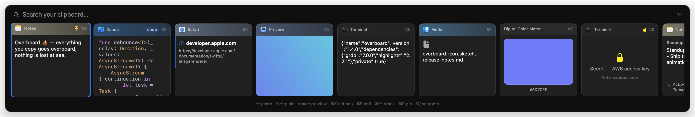
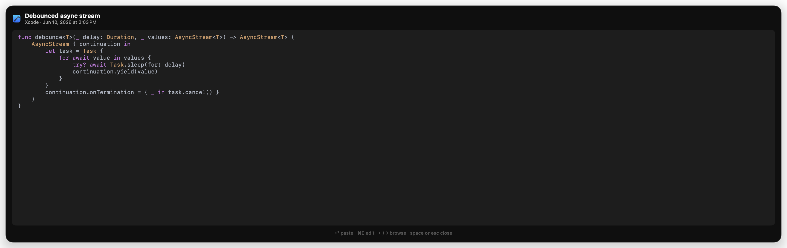
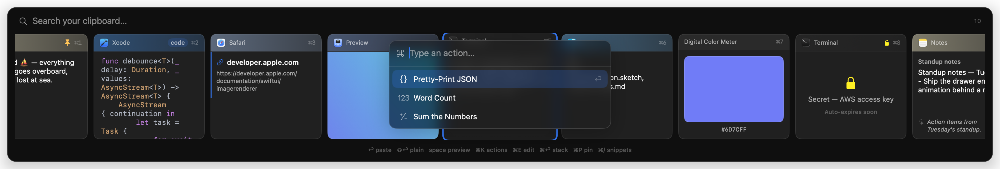
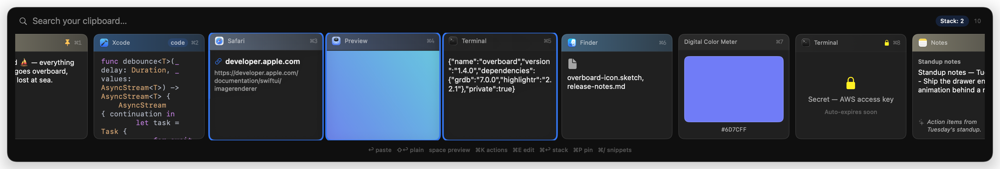

# Overboard ⛵️

Everything you copy goes overboard. A native macOS clipboard manager — a personal,
better Paste: clipboard history, a bottom-drawer picker on a hotkey, instant
full-text search, and paste-back into whatever app you were using.

<p align="center">
  
</p>

## Status

All planned milestones (M0–M4) complete. Daily-drivable.

## Features

- **Capture**: clipboard history for text, rich text, links, images, files,
  and colors, with content-hash dedupe and source-app attribution.
- **Drawer** (⌘⇧V): bottom overlay over any app that never steals focus.
  Type to search, ←/→ or ⌘1–9 to select, ↩ to paste, ⇧↩ plain text,
  ⌘P pin, ⌘⌫ delete, esc to dismiss. Drag cards out to other apps.
- **Search**: FTS5 full-text with prefix matching, blended with on-device
  semantic search (NLEmbedding) so "money projection" finds "quarterly
  revenue forecast". Filter operators: `kind:image`, `app:claude`,
  `category:code`. Nothing ever leaves the machine.
- **Quick Look & edit**: space (or ⌘Y) expands the drawer into a full-content
  preview — scroll long text, see images large, browse with ←/→. ⌘E edits
  the text inline before pasting (⌘↩ pastes the edited version).
- **OCR**: copied images and screenshots are text-recognized (Vision) and
  fully searchable by their contents — find that wifi-password screenshot
  by typing the network name.
- **Apple Intelligence** (macOS 26, on-device, optional): clips get short
  auto-generated titles and category badges (code, error, address, …), and
  the card menu gains AI transforms — summarize, fix grammar, make
  formal/casual, extract action items.
- **Paste-back**: synthesized ⌘V into the app you were in, then your previous
  clipboard is restored. Falls back to copy + HUD without Accessibility.
- **Paste stack**: ⌘↩ queues items in the drawer; ⌥⌘V pastes them one by one.
- **Snippets** (⌘/ in drawer): saved templates with `{date}` `{time}`
  `{datetime}` `{uuid}` `{clipboard}` placeholders, managed from the menu bar.
- **Transforms**: right-click → Paste Transformed (strip tracking params,
  trim, change case).
- **Privacy**: password managers and concealed/transient pasteboards are
  never captured; detected secrets (AWS keys, JWTs, API tokens, PEM keys,
  card numbers) are masked, unsearchable, and auto-expire; per-app
  plain-text paste rules for terminals.

<p align="center">
  
  <br><em>Quick Look (space): full-content preview with syntax highlighting</em>
</p>

<p align="center">
  
  <br><em>⌘K action palette: transforms that match the selected clip</em>
</p>

<p align="center">
  
  <br><em>Multi-select (⇧→) and the paste stack (⌘↩ to queue, ⌥⌘V to paste one by one)</em>
</p>

## Architecture

- `Overboard/` — thin app shell (menu-bar-only app, `LSUIElement`).
- `OverboardKit/` — local Swift package with almost all code:
  - `OverboardCore` — models, GRDB persistence, FTS5 search, capture pipeline.
    Foundation + GRDB only; reusable on iOS someday.
  - `OverboardMac` — the only module allowed to touch `NSPasteboard`,
    `NSWorkspace`, and `CGEvent`. Clipboard monitor, paste-back, permissions.
  - `OverboardUI` — SwiftUI overlay drawer, settings, onboarding.

Dependencies: [GRDB](https://github.com/groue/GRDB.swift) and
[KeyboardShortcuts](https://github.com/sindresorhus/KeyboardShortcuts). That's it.

## Development notes

### Signing & Accessibility (read this before debugging paste-back)

macOS TCC keys the Accessibility grant to the app's code signature. The project
signs with a stable Apple Development identity (automatic signing, team
`HDPU3NY6TJ`). If you build with a different identity or ad-hoc signing, you'll
have to re-grant Accessibility after every build and paste-back will look
"flaky" — it isn't; it's TCC.

### Building

```sh
xcodebuild -project Overboard.xcodeproj -scheme Overboard build   # app
cd OverboardKit && swift test                                     # core tests
```

### Headless debug hooks (DEBUG builds only)

The overlay is scriptable via distributed notifications, so you can drive it
without the hotkey:

```sh
swift -e 'import Foundation; DistributedNotificationCenter.default()
  .postNotificationName(.init("com.nickysemenza.overboard.debug"),
  object: "show", userInfo: nil, deliverImmediately: true)'
```

Commands: `show`, `hide`, `toggle`, `commit`, `commit-plain`, `pin`, `delete`,
`preview`, `next`, `prev`, `extend`, `palette`, `stack`.
Traces append to `/tmp/overboard-trace.log` via `obTrace(_:)`.

### Regenerating the README screenshots

```sh
./scripts/demo-screenshots.sh
```

Launches the app with `OVERBOARD_DEMO=1` (in-memory store seeded by
`DemoSeed.swift` — no real clipboard data), drives it over the
`com.nickysemenza.overboard.demo` notification, and captures the panel into
`docs/screenshots/`. Quit the daily-driver instance first; the terminal needs
Screen Recording permission.

### Manual smoke checklist (run before calling a milestone done)

- [ ] Copy plain text, rich text, an image, and a file in different apps →
      each appears in history with the right kind and source app icon.
- [ ] Copy the same text twice → one row, bumped to the top.
- [ ] Copy in a password field and from 1Password → nothing is captured.
- [ ] Quit and relaunch → history persists.
- [ ] Summon the drawer (⌘⇧V) over a TextEdit document → the drawer appears and
      the document's cursor **keeps blinking** (no focus steal).
- [ ] Type while the drawer is open → search filters; Esc dismisses instantly.
- [ ] Return pastes into TextEdit, Safari's URL bar, Slack, and a terminal.
- [ ] With "restore clipboard" on → after paste-back, the previous clipboard
      contents are back and history isn't polluted.
- [ ] Activity Monitor: ~0% CPU idle, memory flat with images in history.
